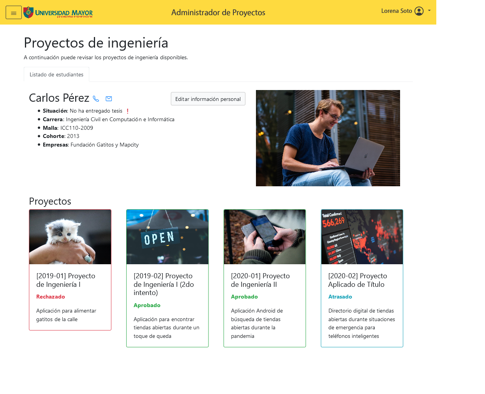

# umayor-ui-proyectos

## Acerca de este repo
Front-end para la gestión de los proyectos de título dentro de la Escuela de Ingeniería en Computación e Informática de la Universidad Mayor. Realizamos templates de Handlebars.js desarrollados según los requerimientos de la Dirección Docente de la escuela, con el propósito de ser integrables a un back-end en el futuro.

  

## Live preview

https://melipass.github.io/umayor-ui-proyectos/
